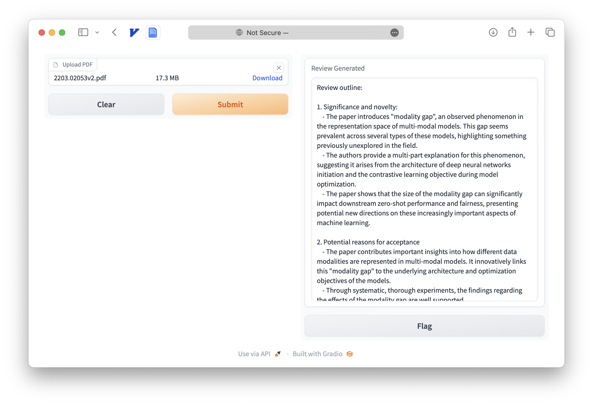

# Can large language models provide useful feedback on research papers? A large-scale empirical analysis.

[](https://www.python.org/downloads/release/python-3100/)
[](https://github.com/ambv/black)
[](https://arxiv.org/abs/2310.01783)

This repo provides the Python source code of our paper: 
[Can large language models provide useful feedback on research papers? A large-scale empirical analysis.](https://arxiv.org/abs/2310.01783)
[[PDF]](https://arxiv.org/pdf/2310.01783.pdf)[[Twitter]](https://twitter.com/james_y_zou/status/1709608909395357946)


```
@inproceedings{LLM-Research-Feedback-2023,
  title={{Can large language models provide useful feedback on research papers? A large-scale empirical analysis}},
  author={Liang, Weixin and Zhang, Yuhui and Cao, Hancheng and Wang, Binglu and Ding, Daisy and Yang, Xinyu and Vodrahalli, Kailas and He, Siyu and Smith, Daniel and Yin, Yian and McFarland, Daniel and Zou, James},
  booktitle={arXiv preprint arXiv:2310.01783},
  year={2023}
}
```


## Abstract

Expert feedback lays the foundation of rigorous research. However, the rapid growth of scholarly production and intricate knowledge specialization challenge the conventional scientific feedback mechanisms. High-quality peer reviews are increasingly difficult to obtain. Researchers who are more junior or from under-resourced settings have especially hard times getting timely feedback. With the breakthrough of large language models (LLM) such as GPT-4, there is growing interest in using LLMs to generate scientific feedback on research manuscripts. However, the utility of LLM-generated feedback has not been systematically studied. To address this gap, we created an automated pipeline using GPT-4 to provide comments on the full PDFs of scientific papers. We evaluated the quality of GPT-4's feedback through two large-scale studies. We first quantitatively compared GPT-4's generated feedback with human peer reviewer feedback in 15 _Nature_ family journals (3,096 papers in total) and the _ICLR_ machine learning conference (1,709 papers). The overlap in the points raised by GPT-4 and by human reviewers (average overlap 30.85% for _Nature_ journals, 39.23% for _ICLR_) is comparable to the overlap between two human reviewers (average overlap 28.58% for _Nature_ journals, 35.25% for _ICLR_). The overlap between GPT-4 and human reviewers is larger for the weaker papers (i.e., rejected _ICLR_ papers; average overlap 43.80%). We then conducted a prospective user study with 308 researchers from 110 US institutions in the field of AI and computational biology to understand how researchers perceive feedback generated by our GPT-4 system on their own papers. Overall, more than half (57.4%) of the users found GPT-4 generated feedback helpful/very helpful and 82.4% found it more beneficial than feedback from at least some human reviewers. While our findings show that LLM-generated feedback can help researchers, we also identify several limitations. For example, GPT-4 tends to focus on certain aspects of scientific feedback (e.g., `add experiments on more datasets'), and often struggles to provide in-depth critique of method design. Together our results suggest that LLM and human feedback can complement each other. While human expert review is and should continue to be the foundation of rigorous scientific process, LLM feedback could benefit researchers, especially when timely expert feedback is not available and in earlier stages of manuscript preparation before peer-review.


## Usage

To run the code, you need to 1) create a PDF parsing server and run in the background, 2) create the LLM feedback server, 3) open the web browser and upload your paper.

### Create and Run PDF Parsing Server

⚠️⚠️⚠️ **ScienceBeam PDF parser only supports x86 Linux operating system. Please let us know if you find solutions for other operating systems!**

```bash
conda env create -f conda_environment.yml
conda activate ScienceBeam
python -m sciencebeam_parser.service.server --port=8080  # Make sure this is running in the background
```

### Create and Run LLM Feedback Server

```bash
conda create -n llm python=3.10
conda activate llm
pip install -r requirements.txt
cat YOUR_OPENAI_API_KEY > key.txt  # Replace YOUR_OPENAI_API_KEY with your OpenAI API key starting with "sk-"
python main.py  # If you have installed ScienceBeam using x86 Linux and want to generate feedback from the raw PDF file
python main_from_text.py  # If you are using other operating systems or want to generate feedback from the parsed paper in text format
```

### Open the Web Browser and Upload Your Paper

Open http://0.0.0.0:7799 and upload your paper. The feedback will be generated in around 120 seconds.

You should get the following output:



If you encounter any error, please first check the server log and then open an issue.

